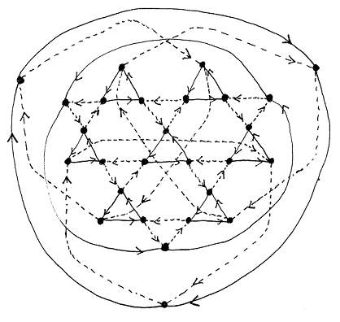

# burnside-graphs



*Image: a nice drawing of the 27-element group B(2,3)*

## A C++ program to compute the Cayley graph of 2-generator Burnside groups

The [Burnside group B(m,n)](https://en.wikipedia.org/wiki/Burnside_problem) is the largest group with m generators and exponent n. This program computes [Cayley graphs](https://en.wikipedia.org/wiki/Cayley_graph) of B(2,n) using a heuristic method that iteratively extends then prunes the graph.

New paths are added in such a way that relations of the form g^n = 1 are likely to cause pruning later on in the process, eventually resulting in a finite graph (which must be the Cayley graph).

The program successfully computes B(2,n) for n = 2, 3, and 4. It's unknown if B(2,5) is finite; if it is finite, it's too large  to be computed in this way. Further, there is no *guarantee* that this program will be able to compute the graph, even given infinite time and memory.

## How to build

You will need C++ compilation tools - I use [mingw-w64](http://mingw-w64.org/doku.php) on Windows, using the g++ compiler:
1. Install mingw-64 and add the executable to your PATH (see instructions [here](https://code.visualstudio.com/docs/cpp/config-mingw#_prerequisites)).
2. ```git clone``` or download and unzip this repo
3. Go the downloaded project folder, open a command shell, and run:
```g++ -g src\*.cpp -o main.exe```

## How to use

**Note:** The program computes the Cayley graph of B(2,3). To compute B(2,2) or B(2,4) you'll need to set *n=2* or *n=4* in the source code and rebuild *main.exe* (see instructions above).

Run ```main.exe```. The program will prompt you to enter new identities - just skip this by typing "n". Once the graph is finished, the program will save *graphinfo.txt* and exit.

*graphinfo.txt* contains all the information needed to construct the Cayley graph: 
1. the distinct nodes (group elements) 
2. the edges labelled with the first generator *x* ("x-edges")
3. the edges labelled with the second generator *y* ("y-edges")